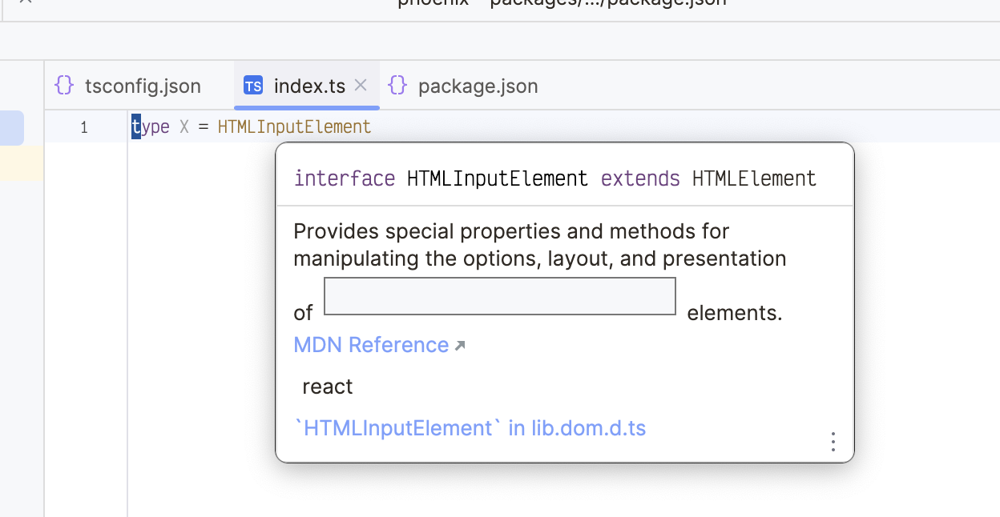
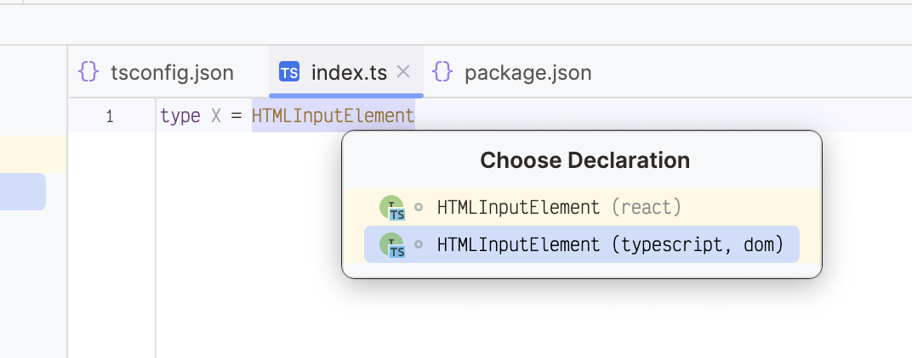

# WEB-63896 repro

When typescript + the react definitely-typed packages are installed, the tooltip for some HTMLElement subclasses will render the element itself.

I have a feeeling it could have something to do with which type definition is used by default. In this repo, the definition from React appears first, and the typescript lib.dom.d.ts definition appears second. If the built-in webstorm defintions are used (i.e., typescript+react is not installed, but typescript files are present), this doesn't occur.

Oddly enough, this WASN'T happening if either package was installed, but the other wasn't. Not sure why they would be dependant?
